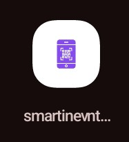
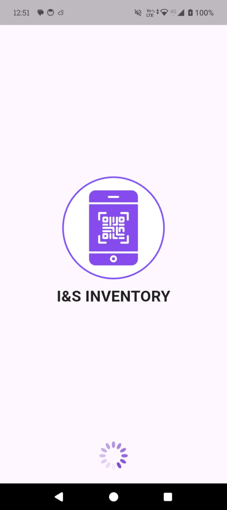
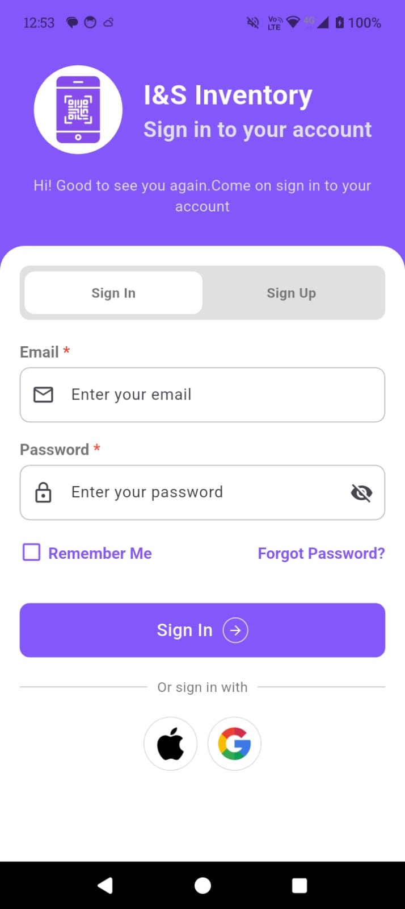
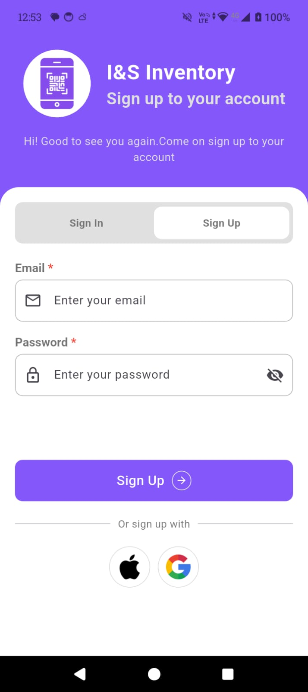
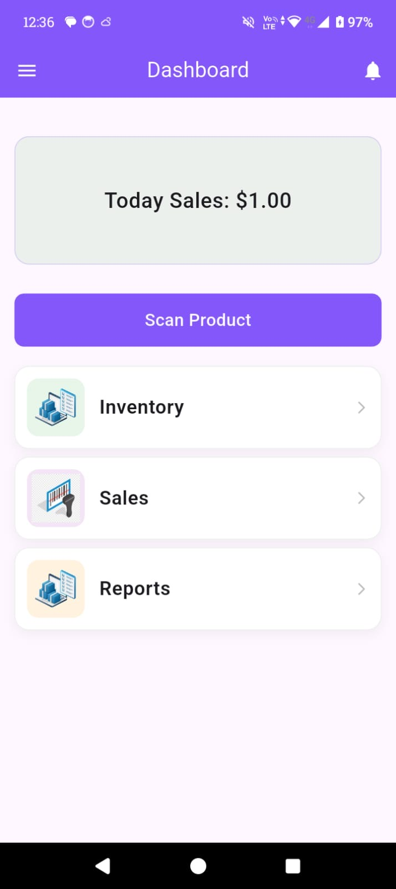
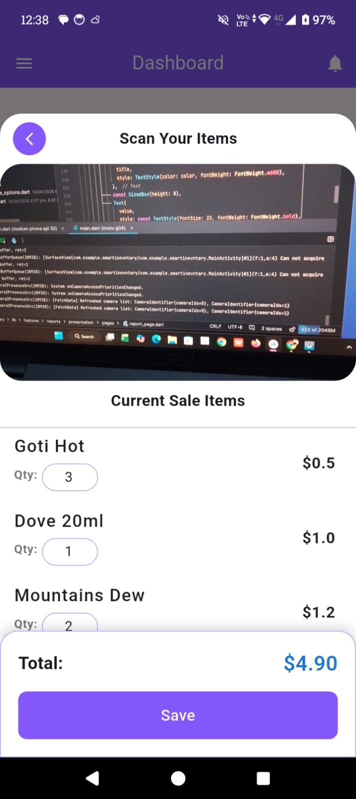
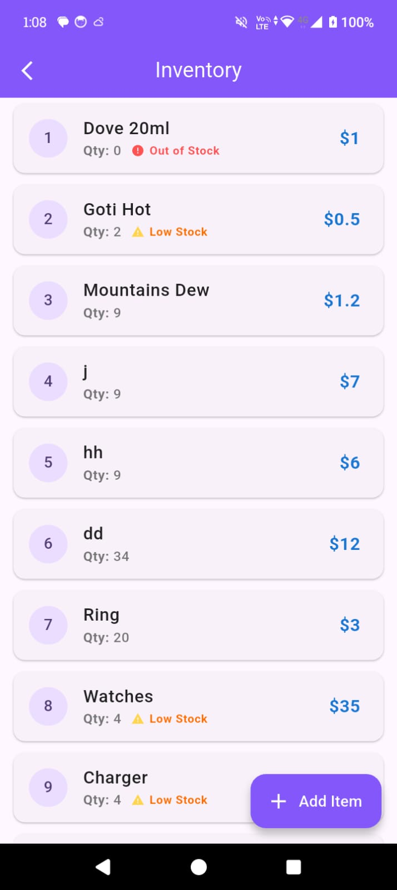
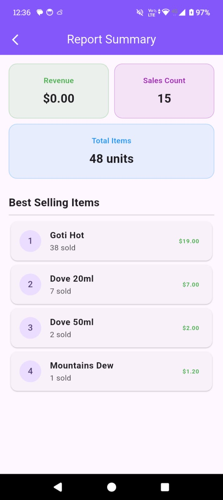
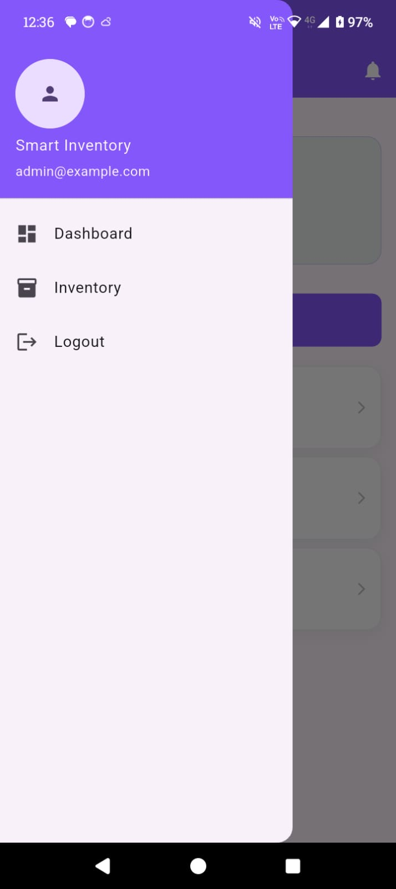
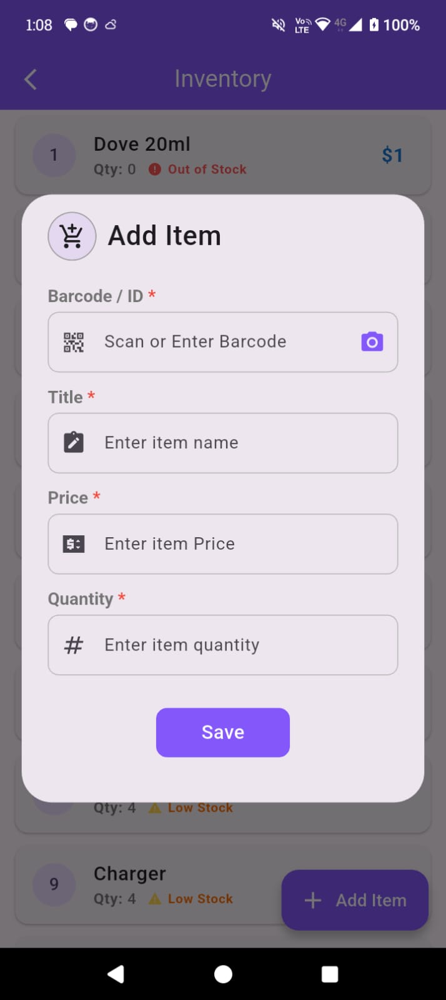

# 🛒 Smart Inventory & Price Oracle (POS)

A professional-grade Point of Sale (POS) and Inventory Management system built with **Flutter** and **Firebase**. This application focuses on real-time data synchronization, high-performance reporting, and seamless barcode integration.

---

## 🚀 Key Features

- **🔍 Barcode Intelligence:** Instant product lookup and stock deduction using the device camera.
- **📈 Advanced Analytics:** Real-time generation of Daily Sales Reports, Total Revenue, and Best Selling Items.
- **📦 Dynamic Inventory:** Full CRUD capabilities for products with real-time Firestore synchronization.
- **⚡ High Performance:** State management handled by **BLoC** for a fast, reactive user interface.
- **📷 Image Management:** Product images hosted and optimized via **Cloudinary** will Add Later.
- **🌐 Offline Support:** Local data persistence using **Shared Preferences** for uninterrupted scanning.

---

## 🛠️ Tech Stack

- **Frontend:** Flutter (Dart)
- **State Management:** BLoC (Business Logic Component)
- **Backend:** Firebase Firestore & Firebase Auth
- **Storage:** Firebase Storage & Cloudinary
- **Architecture:** Clean Architecture (Domain, Data, Presentation)
- **Local DB:** Shared Preferences

---

## 📸 Screenshots
| AppIcon | Splash | SignIn | SignUp |

|  |    |     |                           |

| Dashboard | Barcode Scanner | Inventory | Sales History |

|  |      |            |  |

| Drawer | Add Inventory | Folder Structure | Product Edit |

|  |  |  |

---

## 🎥 Demo Video

👉 **Watch the full app workflow here:** [Click to Watch Demo](YOUR_VIDEO_LINK_HERE)

---

## 🏗️ Technical Architecture

This project follows **Clean Architecture** principles to ensure the code is testable, scalable, and easy to maintain:

* **Domain Layer:** Contains pure business logic (Entities and UseCases).
* **Data Layer:** Implements Repositories and handles data flow from Firestore and Hive.
* **Presentation Layer:** Manages UI state using the BLoC pattern, ensuring a clear separation between logic and views.

---
